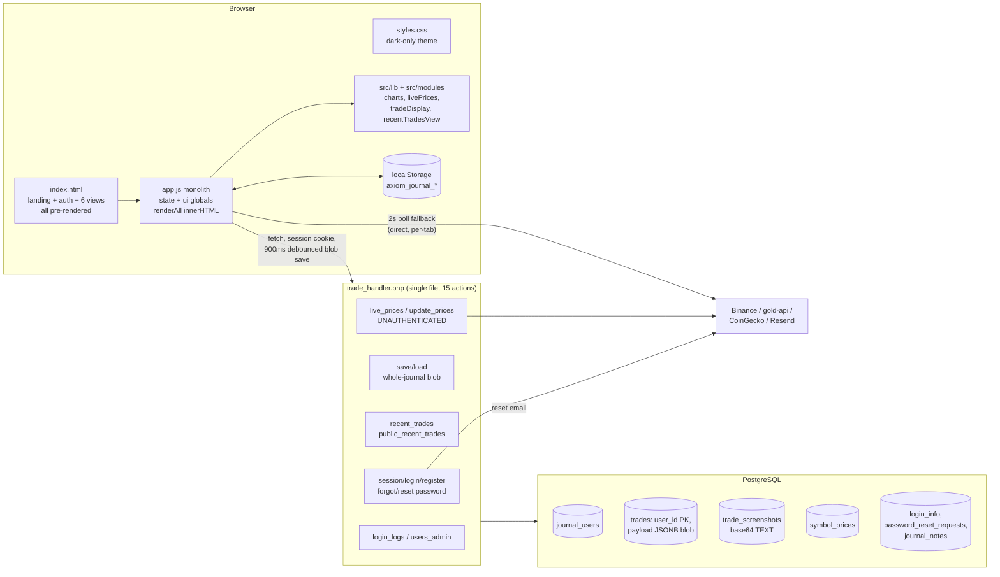

# Trader Journal — Codebase Map (pre-renovation)

## 1) Architecture overview

The entire product is four hand-written artifacts with zero runtime dependencies: one 1087-line HTML page containing landing, auth, and all six app views pre-rendered in the DOM (index.html:1085 loads app.js as an ES module with manual `?v=` cache-busting); one ~3250-line dark-only stylesheet; one 4096-line vanilla-JS controller (app.js) with five partially-extracted modules in `src/`; and one 2106-line procedural PHP file (trade_handler.php) serving a 15-action JSON API over PostgreSQL.

**Frontend.** app.js wires a single global mutable `state` object (app.js:58-109) and a flat `ui` registry of ~120 `getElementById` handles (app.js:111-258). Extracted modules (`src/lib/core.js`, `src/lib/format.js`, `src/modules/{livePrices,tradeDisplay,recentTradesView,charts}.js`) are instantiated as factories at app.js:260-308 but receive the shared `state`/`ui` bags — the split is organizational, not architectural. There is no router: "views" are `.view` sections toggled by CSS class via `switchView` (app.js:587-605); refresh always lands on dashboard. All rendering is string-template `innerHTML` replacement driven by one `renderAll()` orchestrator (app.js:2894-2908) that rebuilds every section on any state change. Charts are hand-rolled canvas 2D (src/modules/charts.js) with hard-coded dark-theme colors.

**Persistence.** Dual-write, local-first: localStorage (keys `axiom_journal_*`, app.js:33-39) plus a 900ms-debounced whole-journal POST to trade_handler.php (`saveToPhpStorage` app.js:2492, `queueServerAutosave` app.js:3781). The server stores each user's **entire trade history as one JSONB blob** (trades.user_id is the PK, schema.sql:32-36) with last-write-wins upserts (upsertJournalData, trade_handler.php:1206-1301). Screenshots are base64 data URLs embedded in trade records (≤350KB, app.js:2160-2193), split server-side into a `trade_screenshots` table that is DELETE-all + reinserted on every save (trade_handler.php:1322-1347).

**Live data.** A 2-second polling loop (LIVE_PRICE_REFRESH_MS, app.js:52) hits the PHP price proxy, falling back to direct client-side Binance/gold-api calls (src/modules/livePrices.js:149-171), and rebuilds the journal table, hero feed, and progress cards via innerHTML on every tick (app.js:4070-4072).

**Auth & deploy.** PHP session cookies with bcrypt (trade_handler.php:48, 90-108); admin gating by username-string match with a "first registered user is admin" fallback (973-1020). Deployed on Railway via a 12-line Dockerfile running `php -S` (the dev server) with `COPY . /app` and no .dockerignore. `ensureSchema` runs ~40 DDL statements on **every request** (trade_handler.php:26, 370-531) as a stand-in for migrations. Any localhost/file:// origin bypasses auth entirely (app.js:639-642).

## 2) Feature inventory (by view)

### Landing / Auth shell (index.html:15-114)
- Hero copy with Log In / Get Started CTAs; CTAs open the auth modal in login or register intent (app.js:415-438, 685-711)
- Public recent-trades board `#recentTradesList` (index.html:39): "Public In Progress / Closed Trades" cards with TP-hit/SL-hit resolution badges and hard-coded "Verified Vantage Trades" pill, expandable, click-to-login (src/modules/recentTradesView.js:25, 149-227)
- Combined login/register panel — single identifier (username or email) + password, buttons choose mode (index.html:52-79; `submitAuth` app.js:964-1018); Enter-to-submit; friendly credential-error rewording (app.js:906-926)
- Forgot-password (email-only) and `?reset=TOKEN` URL-driven reset flow with token state machine (index.html:81-109; app.js:717-773, 1188-1258)
- Session restore on load with server journal auto-load + "Session restored" toast (app.js:838-904); logout with full client teardown (app.js:928-962)
- Local preview modes: localhost/file:// bypasses auth into full app; `?landing=1` forces landing (app.js:313-325, 639-652)
- Trust row (index.html:1062-1066) and footer with BTC/USDT donation addresses in `
` (index.html:1069-1081)

### Shell / navigation
- Six-view SPA nav duplicated for mobile sidebar (index.html:117-154) and desktop top bar (index.html:157-180), with mobile hamburger accordion and outside-click close (app.js:452-456, 587-637)
- Persistent journal action bar: New Trade, Export CSV, in-progress trade ticker (index.html:182-208)
- Keyboard shortcuts: Cmd/Ctrl+S saves trade form, `/` jumps to journal search, Escape closes modals/nav (app.js:537-562; hinted index.html:152)

### Dashboard (index.html:210-497)
- 12 metric cards (index.html:216-265): balance, win rate, profit factor, expectancy, streaks, best/worst day, max/avg drawdown (calculateAnalytics app.js:2990-3191; renderDashboardMetrics app.js:3350-3396)
- Four hand-rolled canvas charts: equity curve, drawdown, setup/asset/weekday performance bars with P&L-vs-count metric toggle, 6-axis trader-score radar (index.html:267-330; src/modules/charts.js:30, 164, 364)
- Discipline monitor: discipline score, daily trading score, trader score (app.js:3193-3293) + risk-violation warnings for daily/weekly loss and risk-per-trade breaches (app.js:3119-3135, 3514-3535)
- Edge-detection table by setup, sorted by expectancy (index.html:356-378; app.js:3537-3573)
- Risk Controls form: starting balance, balance override, daily/weekly max loss, risk %, equity goal (index.html:385-420; app.js:1311-1341)
- Admin-only panels (hidden `
` shipped in public HTML): login activity log with IP/device (index.html:424-457; app.js:2628-2739) and 9-column users view (index.html:459-495; app.js:2741-2859)

### Trade Entry (index.html:521-831)
- Three-section form: date/session/market/asset/direction/entry/SL/TP/exit/risk%/size/result (with Auto derivation)/setup (with Custom free-text)/timeframe, plus collapsible advanced section with psychology rating, execution grade, notes (readTradeForm app.js:1418-1485)
- Domain validation: stop-loss on the wrong side of entry per direction (app.js:1476-1482); exit required only for closed trades (app.js:1472-1474)
- In-progress toggle: clears exit, disables result, stores status=open with zeroed PnL (app.js:1385-1404, 1491-1521)
- Auto-computed metrics denormalized onto each record: net PnL, R-multiple, RR, pips, $/pip (calculateTradeMetrics app.js:2007-2058; pip model getPipSpec app.js:2060-2093)
- 20-symbol asset `<datalist>` autocomplete (index.html:751-772)
- Screenshot attach: inline base64 (≤350KB) with preview, filename-only fallback for larger files (index.html:530; app.js:2160-2199)
- Bulk paste-import from Vantage/Binance/Google Sheets: delimiter auto-detect, quoted-CSV state machine, fuzzy header aliasing, Excel serial dates, 30-row preview, duplicate skip, per-row errors (index.html:775-830; app.js:1524-2005)
- Trade edit (load into form) and delete with confirm (app.js:2255-2342)

### Trade Review / Journal (index.html:833-951)
- 8-field filter grid (date range, market, setup, timeframe, result, psychology, text search) + clear-all (index.html:840-907; app.js:2224-2246, 3575-3686)
- 13-column trades table with edit/delete row actions and live-price cells for open trades (index.html:924-949; tradeDisplay.js:204-235)
- Data actions: CSV export (app.js:2393), JSON backup/import with confirm-and-replace (app.js:2438-2490), manual save/load server DB (index.html:909-920)

### Reflections (index.html:953-1013)
- Daily 4-question form with 5 behavior-tag checkboxes and rule-following flag; capped at 180 entries, latest 40 listed (app.js:2340-2379, 3688-3718)

### Calendar P&L (index.html:499-519)
- Native month picker, month summary strip, JS-rendered grid with per-day P&L, trade count, win rate, top asset (app.js:3398-3503). Display-only — no day click-through.

### Monthly Review (index.html:1015-1058)
- Month picker, 4 metrics (net/win-rate/count/best setup), per-month replay notes (app.js:2381-2391, 3720-3754)

### Live prices (cross-cutting)
- 2s polling with visibility-change refresh (app.js:52, 343, 580-584, 4026-4096); backend proxy → direct Binance/gold-api fallback with client-side cache write-back (livePrices.js:50-80, 149-176)
- Open-trade live snapshots: current price, live % move, dollar move, live pips on hero feed, progress cards, journal rows (tradeDisplay.js:204-235)

### Backend-only features
- Registration by username or email (auto-derives username from email local part, trade_handler.php:695-722); login/logout/session with isAdmin flag
- Password reset: 32-byte token, SHA-256 at rest, 60-min expiry, single-use, sibling invalidation in a transaction (724-811); Resend API email with styled HTML + `mail()` fallback (839-916)
- Login/logout/register audit log with IP/UA (1108-1126)
- Server price proxy for ~19 crypto pairs + XAU/XAG with DB cache (1665-1985)
- Legacy JSON→Postgres migration CLI (scripts/migrate_legacy_json.php)

## 3) Design system today

**Tokens (styles.css:1-21).** 20 custom properties total: 6 accents — green `#2ad48f`, red `#ff5a7e`, blue `#57a1ff`, cyan `#39d3ff`, amber `#ffbe4f`, violet `#8b8cff` (violet unused, styles.css:16) — 3 surfaces, 2 borders, 2 text colors, 1 shadow, 3 radii. **No spacing, typography, z-index, or motion tokens.** Everything else is hardcoded: ~200 raw `rgba()` literals, ~15 near-identical panel gradients (e.g. styles.css:621, 920, 1009, 1040, 1079, 1913, 2616), radius literals 22/16/14/12/10/8/7/999px bypassing the tokens (styles.css:771, 1333, 1407, 1664).

**Palette & look.** Dark-only "trading terminal": near-black navy base `#05080f`, fixed 54px graph-paper grid drawn by `body::before` (styles.css:51-63), two fixed `blur(60px)` neon ambient blobs (cyan `#31d8ff` / periwinkle `#6d8dff`, styles.css:65-88), glassy gradient panels. No light theme, no `prefers-color-scheme`, no `data-theme` hook. Chart colors/fonts are hard-coded separately inside canvas draw code (charts.js:14-24, 81-82, 105, 187, 417).

**Typography.** Dual-voice: Sora/Manrope for headings/UI, JetBrains Mono for every label, kicker, badge, and numeric readout — re-typed via 60+ `font:` shorthands, never tokenized. Sizes range from illegible 0.56rem (~9px, styles.css:333, 431, 485, 2866-2871) up to `clamp(2rem,5vw,3.5rem)` hero type (styles.css:185).

**Layout.** Grid-first, no framework. Breakpoints min-1025 / 1300 / 1024 / 900 / 760 plus a 1025-1180 range, declared out of order with duplicated rule groups (styles.css:2341-2345 vs 2534-2538). Inverted nav: the base-styles 280px sidebar (styles.css:90-98) is hidden at ≥1025px in favor of a separate sticky desktop nav (styles.css:913-993, 2316-2329). Standout pattern: the ≤900px table→labeled-card transform via `td::before{content:attr(data-label)}` (styles.css:2591-2669).

**Complete animation inventory.**
- `@keyframes fadeUp` (8px rise + fade, styles.css:3213-3222) — .auth-shell 420ms, .auth-hero-copy 480ms, .recent-trades-board 320ms, `.view` 260ms on every view switch (styles.css:121, 168, 253, 998)
- `@keyframes brandSettle` (720ms letter-spacing tighten + rise on the logo, styles.css:3224-3235, applied at 647)
- `@keyframes brandAccentPulse` (5.4s **infinite** text-shadow/color glow on the logo accent word, styles.css:3237-3247, applied at 653)
- Transitions: hover-lift `translateY(-1px)` on buttons/nav/rows (140-180ms), `translateX(2px)` sidebar nav (styles.css:744-750), hero h2 hover rise (styles.css:187, 194-197), input focus ring 130ms (styles.css:1243-1249), 9999s webkit-autofill hack (styles.css:1261), auth modal overlay fade 180ms + panel slide-up 240ms `cubic-bezier(0.22,0.8,0.22,1)` with visibility-delay choreography (styles.css:566-612), mobile nav max-height accordion 220ms (styles.css:2453-2498), scroll-hint arrow 180° rotate (styles.css:838-848)
- `prefers-reduced-motion` covers exactly one element — .recent-trades-board (styles.css:3249-3253); the infinite brand pulse and everything else ignore it
- **No** value-change, skeleton, count-up, chart, or scroll-driven animation anywhere — in a live-P&L product, nothing animates a value change

**Other notables.** UI copy baked into CSS `::after` content ('Hide'/'Expand'/'Minimize'/'Show more', styles.css:1382-1388, 1872-1878); no `:focus-visible` styles for buttons/nav (only inputs, styles.css:1243-1249); five `display:none !important` mode hammers (styles.css:779, 859, 909, 2211, 2983); bug: undefined `var(--text-main)` at styles.css:1359, 1633.

## 4) Data model & API surface

### PostgreSQL schema (db/schema.sql) — 7 tables
| Table | Notes |
|---|---|
| `journal_users` | bcrypt password hash; dead `oauth_subject`/`auth_provider` columns with no code path (schema.sql:5-6) |
| `trades` | **user_id is the PK; entire trade history is one JSONB `payload` array** (schema.sql:32-36) |
| `trade_screenshots` | base64 in TEXT, no size cap (schema.sql:38-46); DELETE-all + reinsert every save |
| `journal_notes` | settings/reflections/replay notes blob |
| `symbol_prices` | shared price cache, writable unauthenticated |
| `password_reset_requests` | SHA-256 token hashes, 60-min expiry |
| `login_info` | audit log (IP from spoofable X-Forwarded-For, trade_handler.php:2076-2085) |

Schema is applied by `ensureSchema` running ~40 DDL statements per request (trade_handler.php:370-531). The migration CLI (scripts/migrate_legacy_json.php) duplicates ~15 handler functions and has drifted — its ensureSchema (215-288) lacks the email/auth columns and password_reset_requests table; default journalName 'Chester' vs 'Your' (392-403).

### Client-side trade record
`buildTradeRecord` (app.js:1487-1522) stamps id/timestamps and denormalizes computed metrics (netPnl, rMultiple, rrRatio, pips, $/pip, auto result). Result is triply represented (`tradeResult`/`result`/`autoResult`, app.js:1497-1512, 2311). `screenshotData` is an inline base64 data URL. Server-side `sanitizeTradesPayload` normalizes ~20 snake/camel dual-key fields (trade_handler.php:1475-1528) but keeps unknown keys (1524); `sanitizeArray` is a no-op passthrough (1465-1468). localStorage keys: `axiom_journal_{trades,settings,reflections,replay,last_saved}_v1` (app.js:33-39).

### API surface — trade_handler.php, query-string action router (:31-240), `{ok, error?|data}` envelope
| Action | Method | Auth | Notes |
|---|---|---|---|
| `session` | GET | cookie | `{ok, authenticated, username, isAdmin}` (app.js:751) |
| `register` | POST | — | `{identifier, password}`; transactional, 409 leaks account existence (trade_handler.php:43-88) |
| `login` | POST | — | username or email; no rate limit, no session_regenerate_id (90-108) |
| `logout` | POST | cookie | (app.js:931) |
| `forgot_password` | POST | — | enumeration-safe response (:119); APP_DEBUG returns the reset URL in the response (121-123, 967-971) |
| `validate_reset_token` | GET | — | (:110-156) |
| `reset_password` | POST | token | does not invalidate existing sessions (752-790) |
| `save` | POST | cookie | whole-journal blob upsert, last-write-wins, unbounded body (172-187, 660-673, 1206-1301) |
| `load` | GET | cookie | full journal + merged screenshots (1173-1204, 1401-1421) |
| `recent_trades` | GET | cookie | decodes and PHP-sorts full payload, no LIMIT (1570-1617) |
| `public_recent_trades` | GET | **none** | exposes configured user's ENTIRE history (195-205) |
| `live_prices` | GET | **none** | Binance/CoinGecko/gold-api proxy + cache (207-212, 1665-1985) |
| `update_prices` | POST | **none** | anyone can poison the shared price cache (214-220) |
| `login_logs` | GET | admin | 500-row audit log (1086-1106) |
| `users_admin` | GET | admin | user list with counts + last login (1038-1084) |

Admin = username match on `ADMIN_USERNAMES`/`ADMIN_USERNAME` env, else **first registered user** (973-1020). No CSRF anywhere; sessions with PHP defaults (`session_start()`, trade_handler.php:4).

## 5) Weaknesses & debt (ranked)

### Security (highest priority)
1. **No CSRF protection on any state-changing action** and no session cookie hardening — no SameSite/secure/httponly config, no `session_regenerate_id()` after login (trade_handler.php:4, 83-84, 101-102)
2. **Zero rate limiting** — login brute-forceable (90-108); forgot_password allows unlimited email sends and unbounded reset-row growth (110-125)
3. **Unauthenticated `update_prices`** lets anyone poison the price cache served to all users (214-220); unauthenticated `live_prices` burns third-party quota (207-212)
4. **Repo served as docroot**: `COPY . /app` + `php -S` with no .dockerignore — db/schema.sql, scripts/, and legacy data/users.json (contains password hashes, migrate_legacy_json.php:17, 51) are downloadable (Dockerfile:7, 11)
5. **Bootstrap-admin fallback**: on a fresh deploy with no ADMIN_* env, first registrant becomes admin (997-1020)
6. **Auth bypass by hostname**: any localhost/file:// origin skips auth entirely, not env-flagged (app.js:639-642, 654-656)
7. **APP_DEBUG leaks** raw exceptions and the password-reset URL — one env var from account takeover (2066-2074, 121-123)
8. **`public_recent_trades` privacy leak**: entire trade history, every price and P&L, no LIMIT (1570-1617)
9. Stored data → innerHTML: screenshot data URLs injected unvalidated (app.js:2185, 2327-2334); imported JSON backups unvalidated; server stores raw strings, XSS prevention rests entirely on untested frontend escapeHtml discipline
10. Admin panels + admin gating are client-side only, and the admin table markup ships in public HTML (index.html:424-495); register leaks account existence (trade_handler.php:76-78); X-Forwarded-For trusted unconditionally (2076-2085)
11. Username-only accounts have no password-reset path (727-729); `mail()` fallback is dead in the shipped Alpine image with errors @-suppressed (:873) — resets silently vanish without RESEND_API_KEY

### Data model & reliability
12. **One JSONB blob per user, last-write-wins**: concurrent tabs/devices silently clobber each other; no per-trade CRUD, pagination, or SQL filtering (schema.sql:32-36; trade_handler.php:1206-1301)
13. **Screenshot DELETE-all + reinsert on every save** — write amplification, and a save lacking screenshotData fields destroys stored screenshots (1322-1347); base64 TEXT with no size cap; also bloats localStorage (~14 screenshots to quota) and every sync payload (app.js:2181-2193, 2502-2507)
14. `ensureSchema` runs ~40 DDL statements per HTTP request — latency tax + DDL races (370-531); no migration system; migration CLI has drifted
15. Naive conflict heuristic ("keep local if server empty", app.js:2577-2600) can resurrect deleted data
16. **No automated tests anywhere** (docs/launch-checklist.md admits it)

### UX / design
17. **Mojibake shipped to users**: literal `—` and `∞` in templates (app.js:2945, 2954, 2960-2962, 3356, 3612-3614)
18. **Full innerHTML rebuild of journal table/feed/cards every 2 seconds** — destroys scroll, focus, selection (app.js:4070-4072)
19. Dark-only theme, no light mode hook anywhere; chart theming hard-coded in canvas code (charts.js:14-24)
20. Bulk import **fabricates data**: missing stop/TP/exit invented at ±1% of entry, exit defaults to takeProfit — fictional wins/losses with no visible marker (app.js:1721-1743); all imports forced to status closed (:1780)
21. Trust problems for a "market-ready" product: hard-coded "Verified Vantage Trades" badge with no backing mechanism (recentTradesView.js:132-147); manual closes mislabeled 'TS' by 0.05%-tolerance guessing (tradeDisplay.js:123-155); opaque magic-weight score formulas (app.js:3193-3293); balanceOverride silently contradicts the equity chart (app.js:3105); live % is raw price move, not leveraged P&L (tradeDisplay.js:216-220); profitFactor 999 sentinel renders as corrupted glyph (app.js:3112, 3356)
22. Accessibility: nav buttons lack tablist/aria-current semantics; no focus trap in auth modal (app.js:420-427); no `:focus-visible` for buttons; canvases have aria-label but no data fallback (index.html:273-321); sub-11px text (styles.css:333, 431, 2866); `::after` UI copy invisible to some screen readers; `prefers-reduced-motion` nearly unimplemented (styles.css:3249-3253)
23. No routing/deep links/back-button; 13-column table has no sort/pagination; mobile calendar degrades to a 2-column pseudo-month (styles.css:3005-3008); 900-980px table scroll dead zone (styles.css:1997-2001); reflections silently capped at 180/40 (app.js:2370-2372, 3704); admin panels snap shut on every refresh (app.js:2689-2690, 2805-2806); no loading/disabled states on auth buttons — double-submit possible (app.js:917-926); `background-attachment:fixed` + two `blur(60px)` fixed blobs jank mobile Safari (styles.css:41, 65-72)

### Code
24. Two monoliths: 4096-line app.js closing over global `state`/`ui` (app.js:58-258) and 2106-line trade_handler.php mixing routing/DAL/email/prices; migration script duplicates ~400 lines and drifted
25. Triple-duplicated nav/brand markup (index.html:117-180) styled as two component families (styles.css:614-767 vs 913-993); progress/open/closed card markup re-implemented three times (app.js:2941-2965; recentTradesView.js:149-227)
26. CSS entropy: ~200 rgba literals, no spacing scale, out-of-order/self-duplicating media queries (styles.css:2341-2345 vs 2534-2538, 2526-2546), duplicate .auth-panel rules (578-594, 769-777), five `display:none !important` hammers, undefined `var(--text-main)` (1359, 1633), unused `--violet` (:16)
27. Fragile patterns: 150-line imperative `updateAuthUi` mixing inline styles/classes/hidden attrs (app.js:1037-1186); magic-string screenshot state detection (app.js:1420-1423); result-field triplication (app.js:1497-1512, 2311); dead code `handleLandingPreviewAutoExpand` (app.js:428, 713-715); dead OAuth columns (schema.sql:5-6); hard-coded pip economics + crypto whitelist client-side (app.js:2060-2158) and the 19-pair map duplicated server-side (trade_handler.php:1782-1819, 1945-1982); manual `?v=` cache-busting (index.html:7-9, 1085); brand drift `axiom_journal_*` keys vs 'Trader Journal' (app.js:33-39, 54); no meta description/OG tags on the marketing page

## 6) Renovation opportunities (ranked by user impact)

1. **Security hardening batch** (prerequisite to selling anything): CSRF/SameSite + cookie flags + session_regenerate_id, DB-backed rate limit on login/forgot_password (login_info already has the data, trade_handler.php:1108-1126), auth on `update_prices`, LIMIT + field whitelist on `public_recent_trades`, .dockerignore + real web server, gate the bootstrap-admin fallback, env-flag the localhost auth bypass (app.js:639-642). Mostly config-level changes, all high stakes.
2. **Normalize trades into a real table** with per-trade CRUD — `sanitizeTradesPayload` (trade_handler.php:1475-1528) is the ready-made column spec. Fixes lost updates across devices, kills the screenshot DELETE-all resync, unlocks pagination/SQL analytics/multi-device. The single highest-leverage structural change.
3. **Design-system rebuild on the existing class skeleton**: semantic tokens (surfaces/text/spacing/type/motion/z-index) with light+dark via `data-theme` + `prefers-color-scheme`, then sweep the ~200 rgba literals and 15 gradient panels. Keep the Sora/JetBrains Mono pairing — the strongest existing asset. The consistent panel/metric-card/trade-section markup means restyling needs no restructuring. Theme charts via `getComputedStyle` so canvas follows the palette.
4. **Stop the 2-second full-table rebuild**: update only the class-tagged live-price cells; move price fetching fully server-side (cron/cache in PHP), delete client write-back, slow the poll or use SSE. Instantly fixes scroll/focus destruction and rate-limit fragility.
5. **Motion system**: today's inventory is entrance fades + 1px hover lifts. Add P&L value-change ticks (flash/count-up), chart draw-in, skeletons, View Transitions for view switches — all behind a complete `prefers-reduced-motion` block; kill the infinite brandAccentPulse (styles.css:3237-3247). For a live-P&L product this is the visible payoff.
6. **Quick high-visibility polish wins** (each < a day): fix mojibake (app.js:2945 etc.), define `var(--text-main)` (styles.css:1359, 1633), close the 900-980px table dead zone, pending/disabled states on auth/save buttons, copy-to-clipboard on donation addresses, raise sub-11px text to an 11-12px floor, delete dead `handleLandingPreviewAutoExpand`.
7. **Tiny hash router** replacing `switchView` class toggling (app.js:587-605): deep links, refresh persistence, back-button — free with no build step; add aria-current/tab semantics in the same pass.
8. **Trust & correctness for launch**: mark fabricated bulk-import values in the preview + importBatchId for undo + open-position support (app.js:1605-1637, 1721-1790); remove or back the "Verified Vantage Trades" claim; explain score formulas in-UI; unify balanceOverride vs computed equity; fix the raw-price-move live % (tradeDisplay.js:216-220).
9. **Real screenshot uploads**: server endpoint + file/object storage with a size cap replaces base64-in-record — removes the 350KB cap, localStorage quota risk, sync bloat, and the innerHTML data-URL injection surface (app.js:2185, 2327).
10. **Interactive calendar**: click a day to set journal date filters — filter state already supports dateFrom/dateTo (app.js:94-103). Cheap, high-value; rethink the mobile 2-column pseudo-month as an agenda/heat-strip while there.
11. **Structural cleanup enabling everything above**: finish the src/ factory-module migration for analytics/calendar/admin/sync/auth (pattern at app.js:260-308); split trade_handler.php into ~5 includes and de-drift the migration script; deduplicate nav/brand markup (index.html:117-180); replace `updateAuthUi` with body-state classes + CSS (app.js:1037-1186); replace per-request ensureSchema with deploy-time migration; move pip/contract specs to a data file (app.js:2060-2158); add an HTTP smoke suite over the 15 actions before the trades-table refactor.
12. **Marketing surface**: split landing/auth from the app shell, add meta description/OG tags/theme-color, move admin panels out of shipped HTML (index.html:424-495), replace manual `?v=` cache-busting with a deploy step.